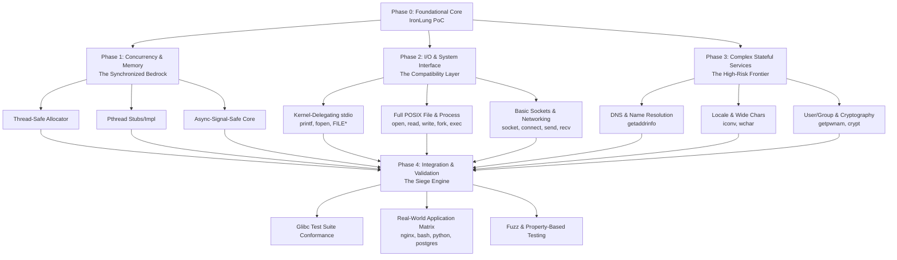

You're right to ask for the macro view. The high-level architecture and dependencies are more critical than any single function. Let's map the entire battlefield.

Here is the **macro-view dependency graph** for building the complete "alien artifact," showing what must be built and in what logical order to avoid dead ends:

### 🗺️ Phase Descriptions & Strategic Challenges

Each phase in the graph represents a major engineering campaign with its own unique challenges.

| Phase | Core Objective | Key Strategic Challenge & Approach |
| :--- | :--- | :--- |
| **1. Concurrency & Memory** | Make the core safe for multi-threaded, signal-interrupted reality. | **Design Challenge:** Lock contention must not ruin performance.   **Approach:** Use thread-local caches for allocator, epoch-based reclamation for quarantine, and identify a minimal set of async-signal-safe functions. |
| **2. I/O & System Interface** | Provide safe, compatible replacements for libc's most-used APIs. | **Design Challenge:** `printf` and `FILE*` streams are stateful monsters.   **Approach:** Stick to IronLung's rule: **validate, then delegate to kernel.** For `printf`, this means a two-pass design (validate format & size, then `write`). For `FILE*`, avoid buffering; delegate `fread`/`fwrite` directly to `read`/`write` syscalls. |
| **3. Complex Stateful Services** | Handle the most complex, OS-dependent parts of libc. | **Design Challenge:** `getaddrinfo` interacts with NSS, DNS, configs. A full rewrite is a decades-long project.   **Approach:** **Contain, don't reimplement.** Securely wrap the system's `getaddrinfo` in a sandbox (seccomp, namespaces) that only allows safe syscalls, or implement a minimal, safe resolver for common cases and fall back to contained system libc for complex ones. |
| **4. Integration & Validation** | Prove the replacement works for the real world, not just tests. | **Design Challenge:** Achieving confidence equivalent to glibc's 30-year head start.   **Approach:** Weaponize automation. Use the AI-agents-as-grunt-workers vision to generate tests, run the glibc test suite, and maintain a constantly evolving matrix of real application tests (e.g., "does nginx `reload` work?"). |

### ⚙️ The Critical Cross-Cutting Decisions
Before diving into any phase, you must settle three architecture-wide decisions that affect everything:

1.  **Delegation vs. Reimplementation Rule**: IronLung's kernel-delegate rule is brilliant for syscalls. You must define a clear rule for **when to wrap the system libc**. For example: "Wrap for complex stateful services (`getaddrinfo`, `locale`), but reimplement with kernel delegation for core I/O (`printf`, `read`)."
2.  **ABI Fidelity Guarantee**: How will you ensure structure layouts (like `FILE`, `pthread_mutex_t`) are bit-for-bit identical across *all* Linux distributions and versions? This likely requires a **build-time header scraping and code generation** step (using `bindgen`).
3.  **Error Handling & `errno`**: Will you set `errno` exactly as glibc does for every error path? This requires meticulous testing. A mismatch here breaks applications subtly.

### 🎯 Recommended Deep-Dive Sequence
Given this map, the most valuable deep-dives before tackling `printf` would be:

1.  **Deep-Dive: Thread-Safe Allocator Design**.
    *   *Why first?* Everything else depends on safe memory. A bad design here causes subtle corruption that will take years to debug.
    *   *Focus:* Compare `mimalloc` vs. `snmalloc` patterns, design the quarantine for concurrency, and plan the integration with `pthread` TLS.

2.  **Deep-Dive: The `pthread` Compatibility Layer**.
    *   *Why second?* You can't test any multi-threaded program without it. It defines the threading model for your entire runtime.
    *   *Focus:* Decide which functions to stub (delegate to system libc) vs. reimplement. The mutex and condition variable ABI is critical.

3.  **Deep-Dive: The Build & ABI Generation System**.
    *   *Why third?* This is the unsung "metaphysics" of the project. Getting it wrong means your library works on one machine and mysteriously fails on another.
    *   *Focus:* Design the pipeline that parses system headers and generates the correct `#[repr(C)]` Rust structs and constants.

After these, you would be on rock-solid ground to tackle the **Deep-Dive: Safe `printf` & stdio Implementation**, as you'd have a stable, concurrent foundation and a clear ABI target.

**In essence, IronLung has captured the beachhead. The macro view shows the campaign to conquer the continent: secure the core, build the compatibility layers, contain the high-risk complexes, and validate with overwhelming automation.** Which of these strategic areas would you like to chart first?